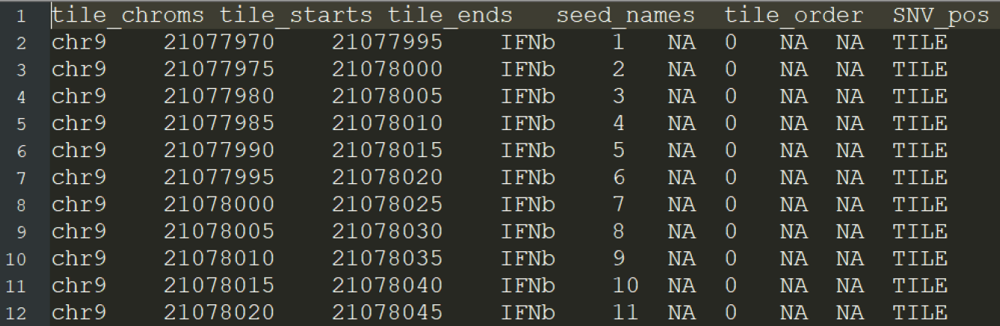
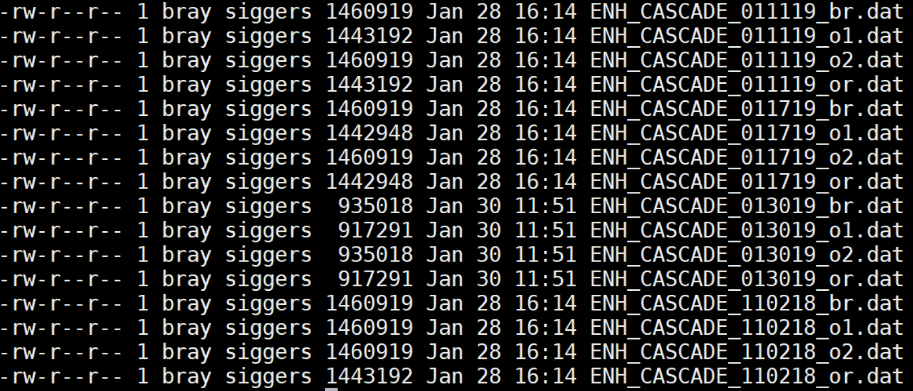
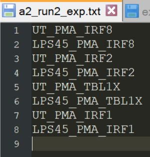
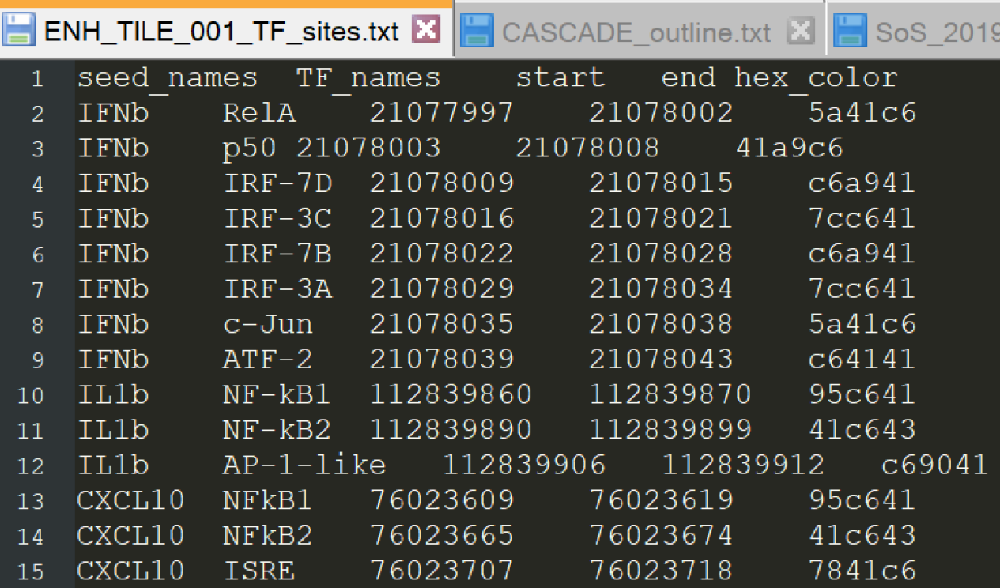
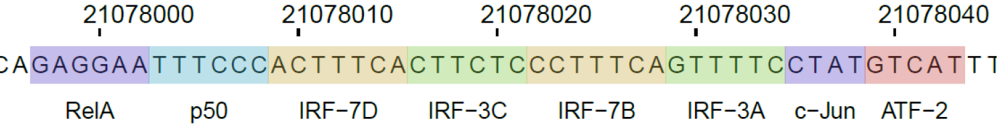
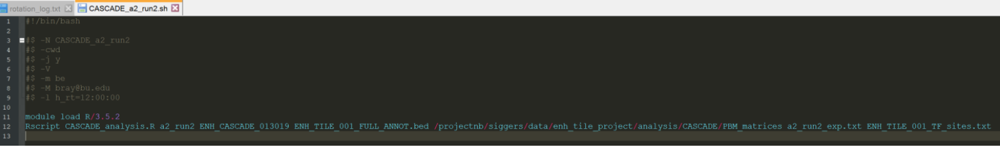
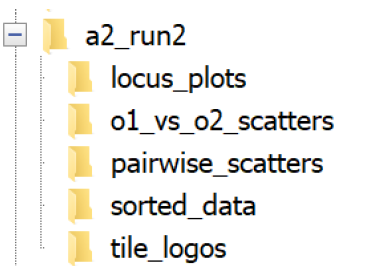

# CASCADE_analysis.R command line documentation
### Dependencies 
The CASCADE_analysis.R Rscript uses several downloadable R packages to plot data. These packages need to be installed to your version of R/3.5.2 prior to running the script for the first time. For all subsequent runs, the packages do not need to be installed again. 
To open the version of R used by the CASCADE_analysis.R script, run the following commands on the cluster: 
```
module load R/3.5.2
R
```
You should now be in an R shell on the cluster. To install the R packages used by CASCADE_analysis.R, run the following commands within the R shell: 
```
install.packages("ggplot2")
install.packages("cowplot")
```
You may need to intervene by selecting a CRAN mirror after executing the first command. Once you receive confirmation that the above packages were successfully installed, you can exit R and bring yourself back to the UNIX shell by using:

```
q()
```

### Rscript description 
To run a CASCADE analysis on the command line (SCC cluster), upload the CASCADE_analysis.R Rscript to the desired folder and submit the following command to the queue: 
```
Rscript CASCADE_analysis.R args[1] args[2] args[3] args[4] args[5] args[6] 
```
Arguments for the script are the following:

args[1] desired output directory name  
args[2] data matrix prefix  
args[3] path to annotation table   
args[4] path to directory with data matrices  
args[5] path to text file with the array conditions (listed in order)  
args[6] path to text file that contains previously annotated TF sites  
  
Since the script takes a while to run, the command needs to be submitted to the queue using a shell script (more info in section below). To view an example, head to the following directory:  
/projectnb/siggers/data/enh_tile_project/analysis/CASCADE/  
Within the "CASCADE_a2_run2.sh" script, we can see the 6 arguments above after the Rscript call:  

args[1] a2_run2  
args[2] ENH_CASCADE_013019  
args[3] ENH_TILE_001_FULL_ANNOT.bed  
args[4] /projectnb/siggers/data/enh_tile_project/analysis/CASCADE/PBM_matrices   
args[5] a2_run2_exp.txt  
args[6] ENH_TILE_001_TF_sites.txt  

The Rscript creates a directory (where ever the script is called from) named using args[1]. The data matrices that begin with the prefix from args[2] are read from the path listed in args[4]. The metadata described in the text file specified by args[5] is used to interpret the columns in the data matrices and these data columns are bound to the array design annotation specified by args[3]. The final args[6] is used to annotate previously known TF sites in the loci included in the given CASCADE design.<br/> 

### Arguments descriptions and formatting 
#### Desired output directory name - args[1]  
This is simply a user-specified name to use as a larger directory to contain all of the subdirectories generated during the analysis. So far I have been using a short descriptor that combines the array number with the run number (like "a2_run2"). The name is also used in the column names of the full annotation table generated so it should be short and not contain any spaces. 
#### Data matrix prefix - args[2] 
This prefix should match the prefix of all relevant data matrices for the current array run. The script expects a corresponding "o1", "o2", "br", and "or" data matrices with the ".dat" file suffix to be within the directory specified by args[4] below. So for example, for the a2_run2 array, args[2] is "ENH_CASCADE_013019" and the following files should be uploaded to the folder in args[4] prior to running the script: 
```
ENH_CASCADE_013019_o1.dat 
ENH_CASCADE_013019_o2.dat 
ENH_CASCADE_013019_br.dat 
ENH_CASCADE_013019_or.dat
```
The prefix is also used to name a text file in the output directory that contains a full matrix that includes the array annotation as well as all of the data matrix columns.   
#### Path to annotation table - args[3] 
This argument is simply the location on the cluster (including file name) where the CASCADE annotation file is located. This file will be the same for a given array design. If the file is uploaded to the same directory as where the CASCADE_analysis.R script is being run from, then only the file name needs to be specified. If running from the /projectnb/siggers/data/enh_tile_project/analysis/CASCADE/ directory, then the argument is only: 
```
ENH_TILE_001_FULL_ANNOT.bed 
```
The annotation is a file that is output from the CASCADE design script. It looks like the following: 



It is a BED formatted text file that contains critical annotation info about each DNA probe on a given array design and is needed for the CASCADE analysis to be performed. 
#### Path to directory with data matrices - args[4] 
This argument is simply the location on the cluster that contains the data matrices relevant to the given array run. I have been keeping all of the CASCADE matrices so far in the following directory:  
/projectnb/siggers/data/enh_tile_project/analysis/CASCADE/PBM_matrices/  
It is a subdirectory in the larger CASCADE analysis directory. As of now, the folder has the following contents:



As shown above, all the .dat files have the same formatting. The names of future data matrices should use the conventions used by the other files. 
#### Path to text file with the array conditions (listed in order) - args[5] 
As with args[3], this argument can be just the file name if the CASCADE_analysis.R script is being run from the same directory that houses the metadata text file. This argument is a small text file that contains names representative of each array condition for the given run. These must be unique, in the order that they appear in the data matrix files, specified on separate lines, and not contain spaces. The argument used for the most recent array run is: 
```
a2_run2_exp.txt 
```
The format of the text file expected is summarized below:



There must be one line for each experiment and a final empty line. So far, I have been using the naming convention: <cell condition 1>_<cell condition 2>_<antibody> 
#### Path to text file that contains previously annotated TF sites - args[6] 
As with the full array annotation, this file will be the same for each array from a given design. Along with the other files specified on the command line, if this file is kept in the same folder as with the previous array runs, only the file name has to be specified and it is already present on the cluster. The argument used is:
```
ENH_TILE_001_TF_sites.txt 
```
It is a plain text file that contains information about known TF sites within a locus contained in the given array design including a name for the site, where it starts within the locus, where it ends, and what color 
(hexadecimal format) should be used to plot the site: 



The information is used by the locus logo plotting module in the generation of the genomic ladder:



### Shell script usage 
To use the command line version of the CASCADE_analysis.R script, create and qsub a shell script that includes the UNIX command to run the Rscript using the 6 arguments that need to be provided by the user. The shell script is a text file that contains the following text:



The easiest way to generate the above file is to modify an existing shell script in the following SCC directory: /projectnb/siggers/data/enh_tile_project/analysis/CASCADE/ 

Arguments that will need to be changed:   

a2_run2 - modify this to the desired name of the current run  
ENH_CASCADE_XXX - modify this to the prefix used for the data matrices  
a2_run_exp.txt - modify this to the text file used to describe the experimental metadata for the current experiment  

The rest of the arguments can remain the same provided that you run the script from the above SCC directory. I usually CTRL+F and replace the array run tag (a2_run2) with a name for the current run and modify the date following the ENH_CASCADE_ prefix. Within the file header, you can also change the email to your own so you can receive a notification when the script is done running. For a 16 experiment array, it takes about an hour.   
To prepare the script to be executed, upload it to the above SCC directory. If you generated the text file using a Windows text editor, it may need to be converted to UNIX format first. To do this, run the following command on the cluster after uploading the shell script:  
```
dos2unix CASCADE_a2_run2.sh
```
If you modified and saved a new shell script on the cluster directly, you do not need to reformat it using the above command.  

To submit the shell script to the cluster to be executed, use the following command, substituting the name of the shell script in the example for the name of the script of the current array: 
```
qsub -P PROJECTNAME CASCADE_analysis.sh
```
### Output directory description 
A directory named using args[1] from the user-specified arguments is created as a subdirectory within the directory that CASCADE_analysis.R was called from. Using the "a2_run2" example, the directory will have the following contents: 



The above folders contain (respectively), the locus logos for each of conditions tested and each of the seeds included on a given array design, the orientation comparison scatters for each experiment, PDFs containing the pairwise comparison scatters between an experiment and each other experiment, the sorted data matrices, and the logos for individual tiles within a locus for each PBM experiment. 


